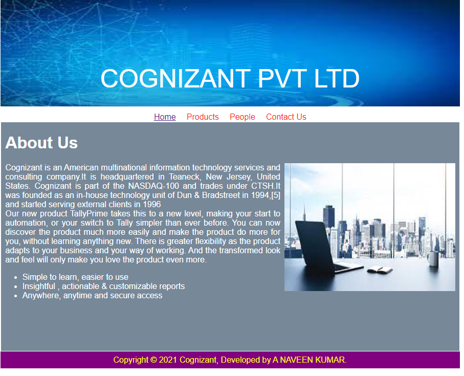
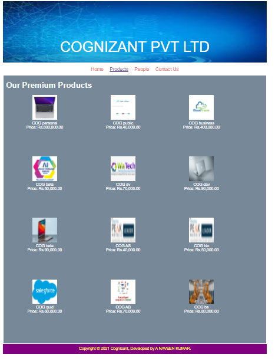
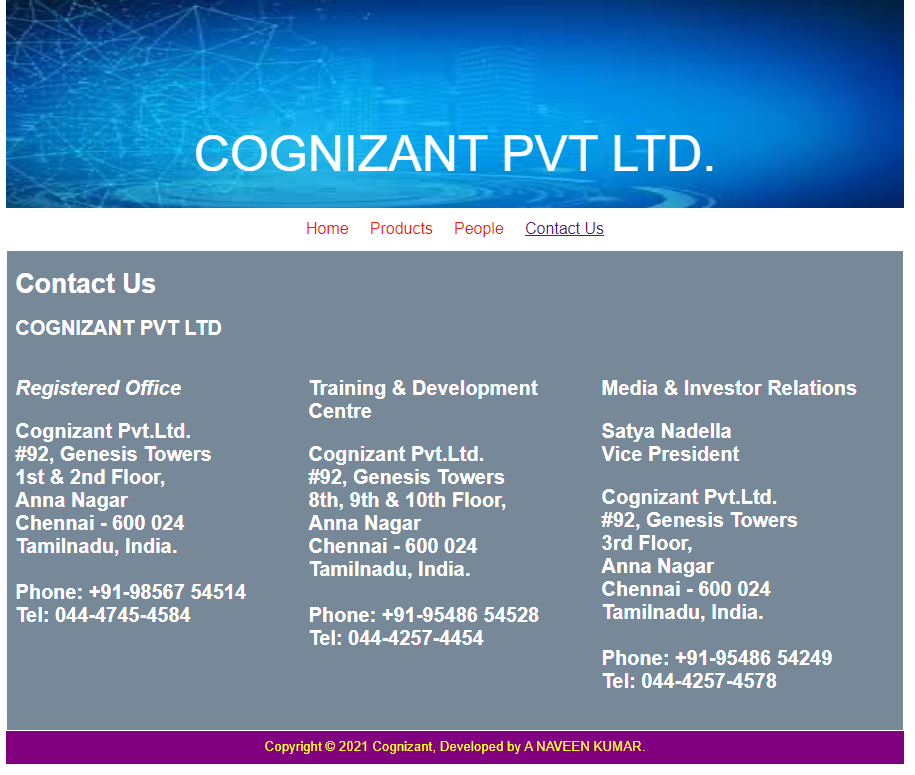

# Web Design for a Software Product Company

## AIM:

To design a static website for a software product company company.

## DESIGN STEPS:

### Step 1:

Requirement collection.

### Step 2:

Creating the layout using HTML and CSS.

### Step 3:

Updating the sample content.

### Step 4:

Choose the appropriate style and color scheme.

### Step 5:

Validate the layout in various browsers.

### Step 6:

Validate the HTML code.

### Step 6:

Publish the website in the given URL.

## PROGRAM : 

 ### HOME CODE:
 ```
<!DOCTYPE html>
<html lang="en">
  <head>
    <title>EduSoft Private Limited</title>
    <link rel="stylesheet" href="./css/layout.css" />
    <link rel="icon" href="./img/icon.png" type="image/x-icon" />
  </head>
  <body>
    <div class="container">
      <div class="banner">COGNIZANT PVT LTD</div>
      <div class="menu">
        <div class="menuitemselected"><a href="/static/home.html">Home</a></div>
        <div class="menuitem"><a href="/static/products.html">Products</a></div>
        <div class="menuitem"><a href="/static/people.html">People</a></div>
        <div class="menuitem"><a href="/static/contactus.html">Contact Us</a> 
      </div>
      <div class="content">
        <div class="homecontent">
          <h1>About Us</h1>
          
          <div class="contenttext">
           Cognizant is an American multinational information technology services
           and consulting company.It is headquartered in Teaneck, New Jersey, United States.
           Cognizant is part of the NASDAQ-100 and trades under CTSH.It was founded as an in-house technology  
           unit of Dun & Bradstreet in 1994,[5] and started serving external clients in 1996
            <br />
            Our new product TallyPrime takes this to a new level, making your
            start to automation, or your switch to Tally simpler than ever
            before. You can now discover the product much more easily and make
            the product do more for you, without learning anything new. There is
            greater flexibility as the product adapts to your business and your
            way of working. And the transformed look and feel will only make you
            love the product even more.
            <ul>
              <li>Simple to learn, easier to use</li>
              <li>Insightful , actionable & customizable reports</li>
              <li>Anywhere, anytime and secure access</li>
            </ul>
          </div>
        </div>
      </div>
      <div class="footer">
        Copyright &#169; 2021 Cognizant, Developed by A NAVEEN KUMAR.
      </div>
    </div>
  </body>
</html>

### PRODUCT CODE:

<!DOCTYPE html>
<html lang="en">
  <head>
    <title>Cognizant</title>
    <link rel="stylesheet" href="./css/layout.css" />
    <link rel="icon" href="./img/icon.png" type="image/x-icon" />
  </head>
  <body>
    <div class="container">
      <div class="banner">COGNIZANT PVT LTD</div>
      <div class="menu">
        <div class="menuitem"><a href="/static/home.html">Home</a></div>
        <div class="menuitemselected">
        <a href="/static/products.html">Products</a></div>       
        <div class="menuitem"><a href="/static/people.html">People</a></div>
        <div class="menuitem"><a href="/static/contactus.html">Contact Us</a>
        </div>
      </div>
      <div class="content">
        <div class="productcontent">    
          <h1>Our Premium Products</h1>
          <div class="productitems">
              <div class="productitem"> 
                  <div class="itemimage">
                  
                  </div>
                  <div class="itemname">COG personal</div>
                  <div class="itemprice">Price: Rs.500,000.00 </div>
              </div>
                <div class="productitem"> 
                    <div class="itemimage">
                    
                    </div>
                    <div class="itemname">COG public</div>
                    <div class="itemprice">Price: Rs.40,000.00 </div>
                </div>
                     <div class="productitem"> 
                      <div class="itemimage">
                      
                      </div>
                      <div class="itemname">COG business</div>
                      <div class="itemprice">Price: Rs.400,000.00 </div>
                  </div>
                    <div class="productitem"> 
                        <div class="itemimage">
                        
                        </div>
                        <div class="itemname">COG beta</div>
                        <div class="itemprice">Price: Rs.50,000.00 </div>
                      </div>
                      <div class="productitem"> 
                          <div class="itemimage">
                          
                          </div>
                          <div class="itemname">COG av</div>
                          <div class="itemprice">Price: Rs.70,000.00 </div>
                        </div>
                        <div class="productitem"> 
                            <div class="itemimage">
                            
                            </div>
                            <div class="itemname">COG dav</div>
                            <div class="itemprice">Price: Rs.90,000.00 </div>
                        </div>
                          <div class="productitem"> 
                              <div class="itemimage">
                              
                              </div>
                              <div class="itemname">COG beta</div>
                              <div class="itemprice">Price: Rs.90,000.00 </div>
                          </div>
                            <div class="productitem"> 
                                <div class="itemimage">
                                
                                </div>
                                <div class="itemname">COG AS</div>
                                <div class="itemprice">Price: Rs.40,000.00 </div>
                            </div>
                              <div class="productitem"> 
                                  <div class="itemimage">
                                  
                                  </div>
                                  <div class="itemname">COG bio</div>
                                  <div class="itemprice">Price: Rs.50,000.00 </div>
                              </div>
                                <div class="productitem"> 
                                    <div class="itemimage">
                                    
                                    </div>
                                    <div class="itemname">COG quid</div>
                                    <div class="itemprice">Price: Rs.60,000.00 </div>
                                  </div>
                                  <div class="productitem"> 
                                      <div class="itemimage">
                                      
                                      </div>
                                      <div class="itemname">COG AB</div>
                                      <div class="itemprice">Price: Rs.70,000.00 </div>
                                  </div>
                                  <div class="productitem"> 
                                    <div class="itemimage">
                                    
                                    </div>
                                    <div class="itemname">COG bs</div>
                                    <div class="itemprice">Price: Rs.80,000.00 </div>
                                </div>
          </div>
          </div>        
      </div>
      <div class="footer">
        Copyright &#169; 2021 Cognizant, Developed by A NAVEEN KUMAR.
      </div>
    </div>
  </body>
</html>

### PEOPLE CODE:

<!DOCTYPE html>
<html lang="en">
  <head>
    <title>COGNIZANT</title>
    <link rel="stylesheet" href="./css/layout.css" />
    <link rel="icon" href="./img/icon.png" type="image/x-icon" />
  </head> 
  <body>
    <div class="container">
      <div class="banner">COGNIZANT PVT LTD</div>
      <div class="menu">
        <div class="menuitem"><a href="/static/home.html">Home</a></div>
        <div class="menuitem">
          <a href="/static/products.html">Products</a>
        </div>
        <div class="menuitemselected"><a href="/static/People.html">People</a></div>
        <div class="menuitem"><a href="/static/contactus.html">Contact us</a></div>
      </div>
      <div class="content">
        <div class="productcontent">    
          <h1>Board of Directors</h1>
          <div class="productitems">
              <div class="productitem"> 
                  <div class="itemimage">
                  
                  </div>
                  <div class="itemname">Leah Lewis</div>
                  <div class="itemprice">Executive Chairman </div>
              </div>
              <div class="productitem"> 
                <div class="itemimage">
                
                </div>
                <div class="itemname">Andy Jassy</div>
                <div class="itemprice"> President and CEO </div>
            </div>
            <div class="productitem"> 
              <div class="itemimage">
              
              </div>
              <div class="itemname">Rosalind Brewer</div>
              <div class="itemprice">Group President and COO</div>
          </div>
          <div class="productitem"> 
            <div class="itemimage">
            
            </div>
            <div class="itemname"> Daniel P. Huttenlocher</div>
            <div class="itemprice">senior vice president and general counsel</div>
        </div>
        <div class="productitem"> 
          <div class="itemimage">
          
          </div>
          <div class="itemname">Eddy Cue </div>
          <div class="itemprice">senior vice president : Internet Software and Services</div>
      </div>
      <div class="productitem"> 
        <div class="itemimage">
        
        </div>
        <div class="itemname">Isabel Ge Mahe</div>
        <div class="itemprice">vice president and managing director :  Greater China</div>
    </div>       
          </div>
          </div>        
      </div>
      <div class="footer">
        Copyright &#169; 2021 Cognizant, Developed by A NAVEEN KUMAR.
      </div>
    </div>
  </body>
</html>

### CONTACTUS CODE:

<!DOCTYPE html>
<html lang="en">
  <head>
    <title class="companyname"> COGNIZANT</title>
    <link rel="stylesheet" href="./css/layout.css" />
    <link rel="icon" href="./img/icon.png" type="image/x-icon" />
  </head>
  <body>
    <div class="container">
      <div class="banner">COGNIZANT PVT LTD.</div>
      <div class="menu">
        <div class="menuitem"><a href="/static/home.html">Home</a></div>
        <div class="menuitem"><a href="/static/products.html">Products</a></div>
        <div class="menuitem"><a href="/static/people.html">People</a></div>
        <div class="menuitemselected"><a href="/static/contactus.html">Contact Us</a></div>
      </div>
      <div class="content">
        <div class="productcontent">    
          <h1>Contact Us</h1>
          <h2>COGNIZANT PVT LTD<h2>
          <table width="100%" border="0" cellspacing="0" cellpadding="0">
            <tr>
              <td width="33%" valign="top">
                    <p><i><strong> Registered Office</strong></i></p>
                    <p>Cognizant Pvt.Ltd.<br />
                    #92, Genesis Towers<br />
                    1st & 2nd Floor,  <br/>
                    Anna Nagar</br>
                    Chennai - 600 024<br />
                    Tamilnadu, India.<br /><br />
                    Phone: +91-98567 54514<br />
                    Tel: 044-4745-4584<br />
                </td>
              <td width="33%" valign="top">
               <p><strong>Training & Development Centre</strong><br/> 
                    <p>Cognizant Pvt.Ltd.<br />
                     #92, Genesis Towers<br />
                     8th, 9th & 10th  Floor, <br/>
                     Anna Nagar</br>
                     Chennai - 600 024<br />
                     Tamilnadu, India.<br /><br />
                     Phone: +91-95486 54528<br />
                     Tel: 044-4257-4454<br />
                </td>
              <td width="33%" valign="top">
               <p><strong>Media & Investor Relations</strong><br/> <p>                          
                      <p><strong>Satya Nadella</strong> <br/>Vice President<p> 
                      <p>Cognizant Pvt.Ltd. <br />
                      #92, Genesis Towers<br />
                      3rd Floor, <br/>
                      Anna Nagar</br>
                      Chennai - 600 024<br />
                      Tamilnadu, India.<br /><br />
                      Phone: +91-95486 54249<br />
                      Tel: 044-4257-4578<br />
                </td>
            </tr>
          </table>
        </div>
      </div>
      <div class="footer">
        Copyright &#169; 2021 Cognizant, Developed by A NAVEEN KUMAR.
      </div>
  </body>
</html>
```


## OUTPUT:


### Home Page:



### PRODUCT PAGE:



### PEOPLE PAGE:


### CONTACTUS PAGE:



## Result:

Thus a website is designed for the software product company and the HTML,CSS code are validated.
